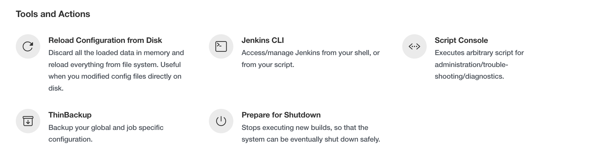
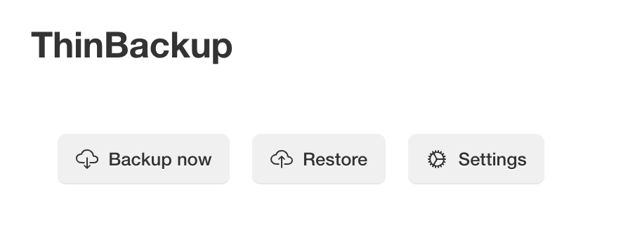
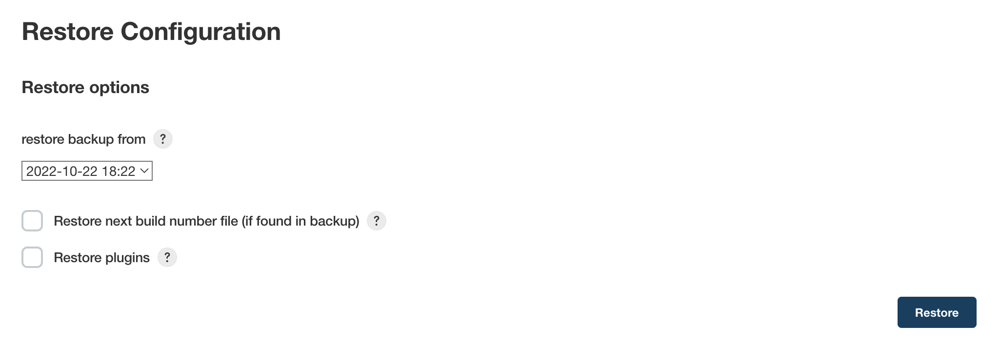

# Thin Backup Plugin

This plugin simply backs up the global and job specific configurations (not the archive or the workspace).

## Why another backup plugin

The [Backup Plugin](https://plugins.jenkins.io/backup/) only does manual backups and
stores all data found in JENKINS\_HOME.  This is sometimes not practical because of time and disk
space requirements and the fact that it can only be manually triggered.  *ThinBackup*s can be
scheduled and only backs up the most vital configuration info.

## Documentation

This plugin adds another management link to "Manage Jenkins" in the Tools section in newer Jenkins versions, called ThinBackup which looks like
this:

This new link provides the following actions:

### Backup Now

Triggers a manual full back up right now.

### Restore

Select the data of the backup you would like to restore.  After the restore finishes you are
redirected to the plugin main page.  To activate the restored settings you need to restart Jenkins.

**Note**: The file **nextBuildNumber** will not be backed up or restored to prevent buildnumber
collision by default.  The archive and the workspace will not be deleted or changed, but all backed
up files will simply be overwritten with the restored versions (e.g., config.xml, thinBackup.xml
-\> for more info simply look in a backup).

.

#### Restore next build number file (if found in backup)

If this option is enabled, the file nextBuildNumber will also be restored.

**Note**: Take special care when restoring a backup that contains a nextBuildNumber file, as this
may potentially cause a lot of problems.

#### Restore plugins

If this option is enabled, the plugins get restored.  You need an active internet connection to the
update server, because plugins will be downloaded from the update server to keep the backup small.

### Settings

#### Backup directory

Specify the backup directory.  The Jenkins process needs write access to this directory.  You can
use environment variables like `${JENKINS_WORKSPACE}` to specify the path.

#### Backup schedule for full backups

Specify schedule when a full backup is triggered.  Cron notation is used.  A full backup backs up
all files even if there were no changes.

#### Backup schedule for differential backups

Specify schedule when a differential backup is triggered.  Cron notation is used.  A differential
backup stores only modified data since the last full backup.  If there are no changes detected, no
diff backup will be created.

**Note**: You do not need to specify a differential backup schedule if you only need full backups.
Because differential backups depend on full backups, a schedule for full backups is mandatory if you
specify a differential backup schedule.

#### Wait until Jenkins is idle to perform a backup

It is very recommended to enable this option (default).  Nevertheless, many users report that the
quiet mode is blocking execution of long-running jobs.  If you disable this option, then the backup
will be made without waiting for a safe state of your instance.  In other words, the backup will be
done immediately, and this could corrupt backups.

#### Force Jenkins to quiet mode after specified amount of minutes

Force a quiet mode after the specified time in minutes to force a safe environment for the back up.
Zero means the quiet mode if forced directly when the back up is triggered by the scheduler.  Read
more about the back up process below.

#### Max number of backup sets

To save disk space, you can specify the maximum number of stored backup sets.  A backup set is
defined as a full backup together with its referencing diff backups.  Older backup sets will be
deleted after the next full backup action.  This also applies to zipped backup sets.

#### Files excluded from backup

If you have specific files you do not want to backup, entering a regex here which identifies those
files will prevent them being backed up.  All files with a name matching this regular expression
will not be backed up.  Leave empty if not needed.  If the expression is invalid, it will be
disregarded.

#### Backup build results

If this option is enabled, build results will also be backed up.  This is potentially a lot of data,
so think carefully about it.  Once you decide to backup build results, also get the option about
backing up your build archives.  Once again, be careful with this option because it could be very
**time consuming** and probably needs **a ton of disk space**!

#### Backup next build number file
If this option is enabled, the file `nextBuildNumber` will also be backed up.

#### Backup 'config-history' folder
If this option is enabled, the directory `config-history` will also be backed up. The plugin which creates this folder is the [Job Configuration History Plugin](https://plugins.jenkins.io/jobConfigHistory/). 

#### Backup 'userContents'

Jenkins provides a URL where you can put common data (e.g., static HTML, Tools, etc.).  You can
backup all of this data if you check this option.

#### Backup only builds marked to keep

If this option is enabled, only results/artifacts on builds which are marked "Keep this build
forever" are backed up.

#### Clean up differential backups

If this option is enabled, all differential backups are removed whenever a new full backup is done.

#### Move old backups to ZIP files

If this is checked, then whenever a new full backup is performed, then all old backup sets will be
moved to ZIP files.  Each ZIP file will contain one backup set (i.e., one full backup and any
differential backups referencing it).  The file name will identify the timeframe where the backups
are included (i.e., the timestamp of the full backup and the timestamp of the latest differential
backup).

**Note**: The setting "Max number of backup sets" applies to backup ZIP files created by *thinBackup*
as well.

**Note**: In case "Clean up differential backups" is checked, differential cleanup will be performed
before zipping is done, and therefore no differential backups will be in the ZIP files.

## Backup process

Because many of you are asking why Jenkins is going to shutdown when a backup is triggered, I
decided to explain my ideas behind the backup process.

First of all, **Jenkins will not be shutdown at any time**.  Second, I use the built-in quiet mode
(Jenkins is going to shutdown) to ensure a safe environment during the backup process and cancel
the quiet mode afterwards.  This could be misleading, **but there is no point where Jenkins will be
shutdown**.

So, what is a safe environment?  A safe environment would mean that no jobs are running. Because a
running job could change a file in the workspace (results, build output, etc.), in this case the
file could be locked. This situation should be avoided by using the quiet mode.

Here is an example of how it works:
- The scheduler triggers a backup.
- There are active jobs and some jobs are waiting in the queue.
- The backup waits for a safe environment (recommended way).  This means running jobs will be
  finished in any case.  Waiting jobs will be started as long as Jenkins is not in quiet mode.  The
  "Force Jenkins to quiet mode after specified minutes" option will force Jenkins after the
  specified time into quiet mode.  From this point, no further jobs will be started until the backup
  is finished.
  - In the case of "Wait until Jenkins is idle to perform a backup" is disabled, then the backup
    will be done immediately.
- The backup starts when no job is running.
- Once the backup is finished the quiet mode will be canceled.  Manually canceling the quiet mode
  will force a new quiet period.

## Feature requests or bug reports

Please let us know if you have another option or feature for this plugin by entering an issue or
write us an email.

Before submitting a feature request or bug report, you can check if it has already been submitted by
searching issues in JIRA categorized under the thin-backup-plugin component or directly on the [plugin site](https://plugins.jenkins.io/jobConfigHistory/#issues)
